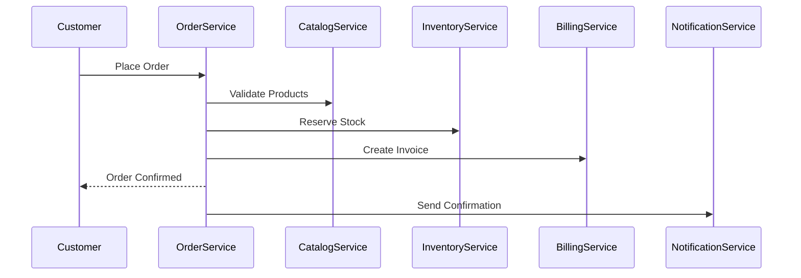

# Microservices Architecture Guide

## Table of Contents
1. [Architecture Overview](#architecture-overview)
2. [Terminology and Concepts](#terminology-and-concepts)
3. [Service Anatomy](#service-anatomy)
4. [Bounded Contexts](#bounded-contexts)
5. [Repository Organization](#repository-organization)
6. [Technology Stack](#technology-stack)
7. [Implementation Roadmap](#implementation-roadmap)

---

## Architecture Overview

This document provides a comprehensive guide to the GoTuto project's microservices architecture, following Domain-Driven Design (DDD) principles for a modern enterprise application deployed on OpenShift/Kubernetes.

### Key Architecture Principles
- **Domain-Driven Design (DDD)** - Business logic drives technical design
- **Microservices** - Each bounded context is an independent service
- **Cloud-Native** - Designed for Kubernetes/OpenShift deployment
- **Event-Driven** - Loose coupling through domain events
- **API-First** - Well-defined contracts between services

### System Goals
1. **Learning Platform** - Learn Go and modern DevOps practices
2. **Enterprise Patterns** - Implement real-world architecture patterns
3. **Production Ready** - Build something that could be used in production
4. **Technology Showcase** - Demonstrate modern cloud-native stack

---

## Terminology and Concepts

### Core Terms Mapping

| DDD Term | Technical Term | Description |
|----------|----------------|-------------|
| **Bounded Context** | **Microservice** | A cohesive business capability with clear boundaries |
| **Aggregate** | **Domain Model** | A cluster of entities and value objects |
| **Domain Event** | **Service Event** | Something important that happened in the domain |
| **Ubiquitous Language** | **Service API** | The common language expressed through APIs |
| **Context Map** | **Service Architecture** | How services relate and communicate |

### Microservice Components

Each microservice (bounded context) contains multiple **artifacts** or **deliverables**:

```
billing-service/                    # The Microservice (Bounded Context)
├── Service Implementation         # Business logic and code
├── Service Configuration          # Environment-specific settings
├── Service Data Store            # Database schema and migrations
├── Service Interface             # API contracts and events
├── Service Deployment            # Kubernetes/Docker artifacts
└── Service Documentation         # Architecture and operations docs
```

### Architecture Layers

1. **System Level**
   - **System/Platform** = The entire application (all microservices)
   - **Domain** = A business area (e.g., e-commerce)

2. **Service Level**
   - **Microservice** = One bounded context
   - **Service Repository** = Git repository for one microservice
   - **Service Instance** = Running copy of a microservice

3. **Component Level**
   - **Service Implementation** = The application code
   - **Service Configuration** = Settings and environment configs
   - **Service Data Store** = Database and persistence layer
   - **Service Interface** = APIs and contracts

4. **Deployment Level**
   - **Service Deployment** = Specific version in an environment
   - **Service Pod** = Running container in Kubernetes
   - **Service Endpoint** = Network access point

### OpenShift/Kubernetes Terminology

```yaml
OpenShift Cluster:
  Project (Namespace): gotuto-dev
    
    Application: gotuto-platform
      
      Deployment: billing-service
        - Pod: billing-service-7d9f8b-x2j4
          - Container: billing-app
        - Service: billing-service-svc
        - Route: billing.apps.openshift.com
        - ConfigMap: billing-config
        - Secret: billing-secrets
        - PVC: billing-postgres-data
      
      Deployment: catalog-service
        - Pod: catalog-service-5b8c9d-k8s2
        - Service: catalog-service-svc
        - Route: catalog.apps.openshift.com
        # ... similar components
```

---

## Service Anatomy

### Standard Microservice Structure

Each microservice follows this standard structure:

```
billing-service/                      # MICROSERVICE ROOT
│
├── cmd/                             # SERVICE ENTRY POINTS
│   ├── api/                         # REST API server
│   ├── worker/                      # Background workers
│   └── migrate/                     # Database migrations
│
├── internal/                        # SERVICE IMPLEMENTATION
│   ├── domain/                      # Domain Layer (DDD)
│   │   ├── model/                   # Entities, Value Objects
│   │   ├── repository/              # Repository interfaces
│   │   └── service/                 # Domain services
│   │
│   ├── application/                 # Application Layer
│   │   ├── command/                 # Command handlers (CQRS)
│   │   ├── query/                   # Query handlers (CQRS)
│   │   └── saga/                    # Saga orchestrators
│   │
│   ├── infrastructure/              # Infrastructure Layer
│   │   ├── persistence/             # Repository implementations
│   │   ├── messaging/               # Event bus integration
│   │   └── external/                # External service clients
│   │
│   └── interfaces/                  # Interface Layer
│       ├── rest/                    # REST API handlers
│       ├── grpc/                    # gRPC service handlers
│       └── events/                  # Event handlers
│
├── api/                            # SERVICE INTERFACE
│   ├── openapi/                    # OpenAPI/Swagger specs
│   │   └── billing-api.yaml
│   ├── protobuf/                   # gRPC definitions
│   │   └── billing.proto
│   └── events/                     # Event schemas
│       └── billing-events.json
│
├── database/                       # SERVICE DATA STORE
│   ├── migrations/                 # Schema migrations
│   │   ├── 001_initial.up.sql
│   │   └── 001_initial.down.sql
│   ├── seeds/                      # Test/demo data
│   └── schema.sql                  # Current schema doc
│
├── configs/                        # SERVICE CONFIGURATION
│   ├── base.yaml                   # Base configuration
│   ├── development.yaml            # Dev overrides
│   ├── staging.yaml                # Staging overrides
│   └── production.yaml             # Prod overrides
│
├── deployments/                    # SERVICE DEPLOYMENT
│   ├── docker/
│   │   ├── Dockerfile              # Multi-stage build
│   │   └── docker-compose.yaml     # Local development
│   ├── kubernetes/
│   │   ├── base/                   # Base manifests
│   │   ├── overlays/               # Environment overlays
│   │   └── kustomization.yaml      # Kustomize config
│   └── helm/
│       └── billing-service/        # Helm chart
│
├── scripts/                        # SERVICE UTILITIES
│   ├── build.sh                    # Build scripts
│   ├── test.sh                     # Test runners
│   └── release.sh                  # Release automation
│
├── tests/                          # SERVICE TESTS
│   ├── unit/                       # Unit tests
│   ├── integration/                # Integration tests
│   ├── e2e/                        # End-to-end tests
│   └── performance/                # Performance tests
│
└── docs/                          # SERVICE DOCUMENTATION
    ├── architecture.md             # Architecture decisions
    ├── api.md                      # API documentation
    ├── runbook.md                  # Operations guide
    └── development.md              # Developer guide
```

### Component Descriptions

#### Service Implementation (Code)
- **Domain Layer**: Pure business logic, no external dependencies
- **Application Layer**: Use case orchestration, transaction boundaries
- **Infrastructure Layer**: External integrations, database access
- **Interface Layer**: API endpoints, message handlers

#### Service Configuration
- **Base Config**: Common settings across all environments
- **Environment Configs**: Environment-specific overrides
- **Feature Flags**: Runtime feature toggles
- **Secrets**: Sensitive configuration (passwords, API keys)

#### Service Data Store
- **Migrations**: Versioned schema changes
- **Seeds**: Initial or test data
- **Backup Strategy**: Data protection approach
- **Partitioning**: Data isolation strategy

#### Service Interface
- **REST API**: Synchronous HTTP endpoints
- **gRPC API**: High-performance internal communication
- **Events**: Asynchronous domain events
- **GraphQL**: Optional query interface

#### Service Deployment
- **Container**: Docker image with app
- **Orchestration**: Kubernetes manifests
- **Configuration**: ConfigMaps and Secrets
- **Networking**: Services and Ingress/Routes

---

## Bounded Contexts

### Current Implementation Status

| Context | Status | Description | Priority |
|---------|--------|-------------|----------|
| **Billing** | ✅ Complete | Financial transactions, invoicing | Done |
| **Catalog** | 🚧 Testing | Product management | High |
| **Order** | 📋 Planned | Purchase orchestration | High |
| **Customer** | 📋 Planned | Identity and auth | Medium |
| **Inventory** | 📋 Planned | Stock management | Medium |
| **Shipping** | 📋 Planned | Fulfillment | Low |
| **Notification** | 📋 Planned | Communications | Low |

### 1. Billing Context ✅
**Status:** Fully implemented with 100% test coverage  
**Microservice Name:** `billing-service`  
**Business Capability:** Manages financial transactions and client relationships

#### Aggregates
- **Client** (Aggregate Root)
  - Properties: ID, Name, Email, Phone, Address
  - Business Rules: Cannot be deleted if has invoices
  - Relationships: Has many invoices

- **Invoice** (Aggregate Root)
  - Properties: ID, Number, Amount, Status, IssueDate, DueDate
  - Business Rules: 
    - Status transitions: Draft → Sent → Paid/Overdue
    - Cannot delete paid invoices
    - Automatic overdue detection
  - Relationships: Belongs to one client

#### Domain Events (Planned)
- `ClientCreated`
- `ClientUpdated`
- `ClientDeleted`
- `InvoiceCreated`
- `InvoiceStatusChanged`
- `PaymentReceived`

---

### 2. Catalog Context 🚧
**Status:** Structure implemented, testing pending  
**Microservice Name:** `catalog-service`  
**Business Capability:** Manages product information and categorization

#### Aggregates
- **Product** (Aggregate Root)
  - Properties: ID, Name, Description, Price, SKU, CategoryID
  - Business Rules: 
    - Must belong to a category
    - Price must be positive
    - SKU must be unique
  - Relationships: Belongs to one category

- **Category** (Aggregate Root)
  - Properties: ID, Name, Description, ParentID
  - Business Rules:
    - Can have hierarchical structure
    - Cannot delete if has products
  - Relationships: Has many products, can have parent/children

#### Domain Events (Planned)
- `ProductCreated`
- `ProductUpdated`
- `ProductDeleted`
- `PriceChanged`
- `CategoryCreated`
- `CategoryUpdated`

---

### 3. Order Context 📋
**Status:** Planned - High Priority  
**Microservice Name:** `order-service`  
**Business Capability:** Orchestrates the purchasing process across domains

#### Suggested Aggregates
- **Order** (Aggregate Root)
  - Properties: ID, OrderNumber, CustomerID, Status, TotalAmount, OrderDate
  - Business Rules:
    - Implements saga pattern for distributed transactions
    - Status workflow: Pending → Confirmed → Processing → Shipped → Delivered
    - Coordinates with inventory for stock reservation
  - Contains: OrderItems (Value Objects)

- **Cart** (Aggregate Root)
  - Properties: ID, SessionID, CustomerID, ExpiresAt
  - Business Rules:
    - Temporary storage before order creation
    - Auto-expiration after inactivity
  - Contains: CartItems (Value Objects)

#### Domain Events
- `OrderPlaced`
- `OrderConfirmed`
- `OrderShipped`
- `OrderDelivered`
- `OrderCancelled`
- `CartCreated`
- `CartExpired`

---

### Context Map

```
┌─────────────────┐         ┌─────────────────┐
│    Customer     │←───────→│     Billing     │
│    Context      │ shares  │    Context      │
│                 │customer │                 │
└────────┬────────┘concept  └────────┬────────┘
         │                            │
         │                            │ creates
         │                            │ invoices
         ▼                            ▼
┌─────────────────┐         ┌─────────────────┐
│     Order       │────────→│    Catalog      │
│    Context      │ queries │    Context      │
│                 │products │                 │
└────────┬────────┘         └─────────────────┘
         │                            ▲
         │ reserves                   │
         │ stock                      │ queries
         ▼                            │ stock
┌─────────────────┐         ┌─────────────────┐
│   Inventory     │────────→│    Shipping     │
│    Context      │ informs │    Context      │
│                 │ stock   │                 │
└─────────────────┘         └─────────────────┘
         │
         │ all contexts
         │ publish events to
         ▼
┌─────────────────┐
│  Notification   │
│    Context      │
└─────────────────┘
```

### Relationship Types
- **Shared Kernel:** Customer-Billing (share customer concept)
- **Customer-Supplier:** Order→Catalog, Order→Inventory
- **Conformist:** All→Notification (conform to event structure)
- **Anti-Corruption Layer:** External integrations (payment, shipping)

---

## Repository Organization

### Current State: Modular Monolith
```
GoTuto/                           # Single repository
├── internal/
│   ├── billing/                  # Billing bounded context
│   └── catalog/                  # Catalog bounded context
└── cmd/
    ├── billing-api/              # Billing service entry point
    └── catalog-api/              # Catalog service entry point
```

### Evolution Strategy

#### Phase 1: Enhanced Monorepo (Current → 2 months)
Keep single repository but improve structure:
```
GoTuto/
├── services/                     # Microservices
│   ├── billing/
│   ├── catalog/
│   └── order/
├── libraries/                    # Shared code
│   ├── events/
│   └── common/
└── platform/                     # Platform-level code
    ├── api-gateway/
    └── deployment/
```

#### Phase 2: Modular Monorepo (Month 3)
Add independent Go modules:
```
GoTuto/
├── services/
│   ├── billing/     (go.mod)    # Independent module
│   ├── catalog/     (go.mod)    # Independent module
│   └── order/       (go.mod)    # Independent module
├── libraries/
│   └── shared/      (go.mod)    # Shared module
└── go.work                       # Go workspace file
```

#### Phase 3: Selective Polyrepo (Month 4+)
Extract services to separate repositories:
```
github.com/yourorg/
├── billing-service/              # Separate repository
├── catalog-service/              # Separate repository
├── gotuto-platform/              # Platform components
└── gotuto-libraries/             # Shared libraries
```

### Repository Patterns

| Pattern | When to Use | Pros | Cons |
|---------|-------------|------|------|
| **Monorepo** | Early development, small team | Easy refactoring | Scaling limits |
| **Modular Monorepo** | Growing system, clear boundaries | Best of both | Complex setup |
| **Polyrepo** | Large teams, mature services | True independence | Coordination overhead |
| **Hybrid** | Mixed requirements | Flexible | Inconsistent |

### Decision Criteria

**Stay with Monorepo when:**
- Single developer/small team
- Rapid prototyping needed
- Significant code sharing
- Unified deployment preferred

**Move to Polyrepo when:**
- Multiple teams working independently
- Services have different release cycles
- Different technology stacks needed
- Compliance requires separation

---

## Technology Stack

### Core Technologies

| Category | Technology | Purpose |
|----------|------------|---------|
| **Language** | Go | Primary development language |
| **Database** | PostgreSQL | Relational data storage |
| **Cache** | Redis | Caching and pub/sub |
| **Message Broker** | Kafka | Event streaming (production) |
| **Container** | Docker | Application packaging |
| **Orchestration** | OpenShift/K8s | Container orchestration |
| **Service Mesh** | Istio | Traffic management |
| **API Gateway** | Kong/Traefik | API routing |
| **Monitoring** | Prometheus | Metrics collection |
| **Visualization** | Grafana | Metrics dashboards |
| **Tracing** | Jaeger | Distributed tracing |
| **Logging** | ELK Stack | Log aggregation |
| **CI/CD** | Tekton | Cloud-native pipelines |
| **GitOps** | ArgoCD | Deployment automation |

### Per-Service Stack

```yaml
Service Technologies:
  API:
    - REST (Gin/Echo framework)
    - gRPC (internal communication)
    - GraphQL (optional query layer)
  
  Database:
    - PostgreSQL (primary storage)
    - Redis (caching layer)
    - Elasticsearch (search/analytics)
  
  Messaging:
    - Redis Pub/Sub (development)
    - Kafka (production)
    - NATS (lightweight option)
  
  Observability:
    - OpenTelemetry (instrumentation)
    - Prometheus (metrics)
    - Jaeger (tracing)
    - Fluentd (logging)
```

### Development Tools

```yaml
Local Development:
  - Docker Compose (service orchestration)
  - Skaffold (Kubernetes development)
  - Telepresence (remote debugging)
  - Kind/Minikube (local Kubernetes)

Code Quality:
  - golangci-lint (linting)
  - go test (testing)
  - go-acc (coverage)
  - pre-commit (git hooks)

API Development:
  - Swagger/OpenAPI (REST documentation)
  - Postman/Insomnia (API testing)
  - grpcurl (gRPC testing)
  - GraphQL Playground (GraphQL testing)
```

---

## Implementation Roadmap

### Phase 1: Foundation (Current - Week 2)
- [x] Billing Context - Complete implementation
- [ ] Catalog Context - Complete testing
- [ ] Repository pattern implementation
- [ ] Service layer implementation
- [ ] Domain events design

### Phase 2: Microservices Preparation (Week 3-4)
- [ ] Extract shared interfaces
- [ ] Design event schemas
- [ ] Add health checks
- [ ] Optimize Docker builds
- [ ] Create service templates

### Phase 3: Cross-Domain Implementation (Week 5-6)
- [ ] Order Context - Core implementation
- [ ] Saga pattern for distributed transactions
- [ ] Event bus integration (Redis)
- [ ] Inter-service communication

### Phase 4: Microservices Deployment (Week 7-8)
- [ ] Kubernetes manifests
- [ ] Service discovery
- [ ] API Gateway setup
- [ ] OpenShift deployment
- [ ] Monitoring setup

### Phase 5: Production Features (Week 9-10)
- [ ] Customer Context
- [ ] Inventory Context
- [ ] Circuit breakers
- [ ] Distributed tracing
- [ ] Performance optimization

### Phase 6: Advanced Platform (Week 11-12)
- [ ] Service mesh (Istio)
- [ ] Advanced monitoring
- [ ] CI/CD per service
- [ ] GitOps workflow
- [ ] Chaos engineering

### Success Criteria

**Technical Metrics:**
- Independent deployability
- < 200ms API response time (p95)
- > 99.9% availability per service
- < 5 minute deployment time
- Zero-downtime deployments

**Learning Goals:**
- Master Go programming patterns
- Understand microservices trade-offs
- Implement cloud-native patterns
- Practice DevOps workflows
- Build production-grade system

---

## Event Flows

### Order Placement Saga


### Event Sourcing Pattern
```
Order Aggregate:
  Events:
    - OrderPlaced
    - PaymentReceived
    - OrderShipped
    - OrderDelivered
  
  State Reconstruction:
    Apply events in sequence to rebuild current state
```

---

## Deployment Architecture

### OpenShift Project Structure
```
openshift-cluster/
├── gotuto-dev/                   # Development environment
│   ├── billing-service
│   ├── catalog-service
│   ├── postgresql
│   ├── redis
│   └── kafka
├── gotuto-staging/               # Staging environment
│   └── ... (same structure)
└── gotuto-prod/                  # Production environment
    └── ... (same structure)
```

### GitOps Workflow
```
1. Developer pushes code → GitHub
2. Tekton pipeline builds → Container image
3. ArgoCD detects change → Updates manifests
4. OpenShift applies → New deployment
5. Monitoring alerts → If issues detected
```

---

## Security Considerations

### Service-to-Service
- mTLS for all internal communication
- Service mesh enforced policies
- API Gateway authentication
- OAuth2/OIDC for external APIs

### Data Protection
- Encryption at rest (database)
- Encryption in transit (TLS)
- Secrets management (Vault)
- PII handling compliance

### Network Policies
- Zero-trust networking
- Explicit ingress/egress rules
- Service isolation
- Rate limiting

---

## Operational Considerations

### Monitoring Stack
```
Metrics Pipeline:
  Service → Prometheus → Grafana
  
Logging Pipeline:
  Service → Fluentd → Elasticsearch → Kibana
  
Tracing Pipeline:
  Service → Jaeger Agent → Jaeger Collector → Jaeger UI
```

### Deployment Strategies
- **Blue-Green**: Full environment swap
- **Canary**: Gradual rollout
- **Rolling**: Sequential updates
- **Feature Flags**: Runtime control

### Disaster Recovery
- Database backups (automated)
- Multi-region deployment (future)
- Chaos testing (failure injection)
- Runbook documentation

---

*Document Version: 2.0*  
*Last Updated: January 28, 2025*  
*Architecture Pattern: DDD Microservices on OpenShift*

## Next Steps
1. Complete Catalog testing
2. Implement repository pattern
3. Design domain events
4. Plan Order context implementation
5. Create deployment templates